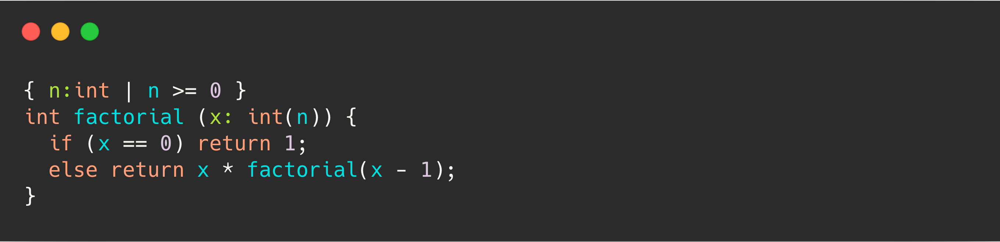

# Q Sort Items

Below are the 36 language features presented to participants, along with any accompanying image and description. In cases where the feature was unfamiliar or unavailable in a participant's chosen language, participants were asked to consider how it *might* impact their practice if it were available or to rate the feature as "Neutral" if they were unsure.

---

## The ability to restrict or constrain function arguments

Known as "dependent typing", this type system allows a type's definition to depend on a value.

In the example above, the factorial function is defined. It takes one argument, an integer, but has an additional constraint applied to it. The factorial function can only be called with natural numbers: numbers greater than zero.

Attempting to call factorial(-1) would result in a compile-time error meaning less run-time code is dedicated to input validation.
